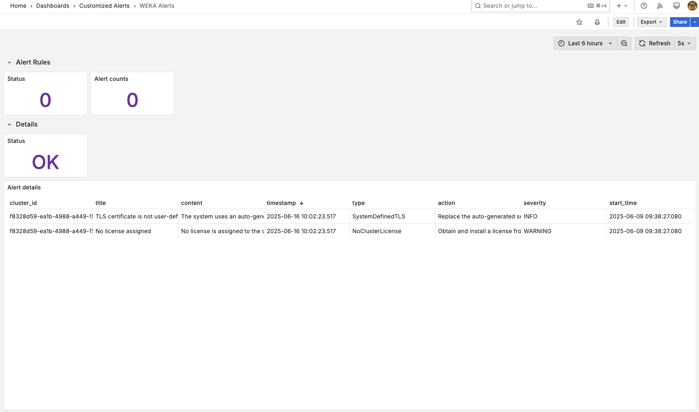

# WEKA Alerts Dashboard & Alert Rule (LWH - Grafana)

This repository includes a preconfigured Grafana dashboard and alert rules to monitor WEKA from Local WEKA Home Grafana.

## 📦 Files Included

| File                                 | Description                                |
|--------------------------------------|--------------------------------------------|
| `dashboard-WEKA-Alerts.json`         | Grafana dashboard JSON for displaying alert counts and details |
| `Alerting-Customized-Alerts.json`    | Grafana alert rule JSON to trigger email notification when alerts appear or disappear |

---

## 📥 How to Import

### 1. Import the Dashboard

1. Open your Grafana instance.
2. Go to **Dashboards → Import**.
3. Upload `dashboard-WEKA-Alerts.json` or paste its content.
4. Assign the correct **PostgreSQL data source** when prompted.

### 2. Import the Alert Rule

1. Go to **Alerting → Alert rules**.
2. Click **⋮** → **Import**.
3. Upload `Alerting-Customized-Alerts.json` or paste its content.
4. Confirm the data source and contact point match your environment.

---

* Dashbaord

* Alert Rules

